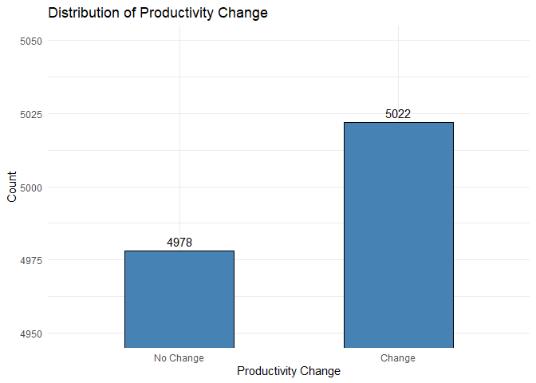
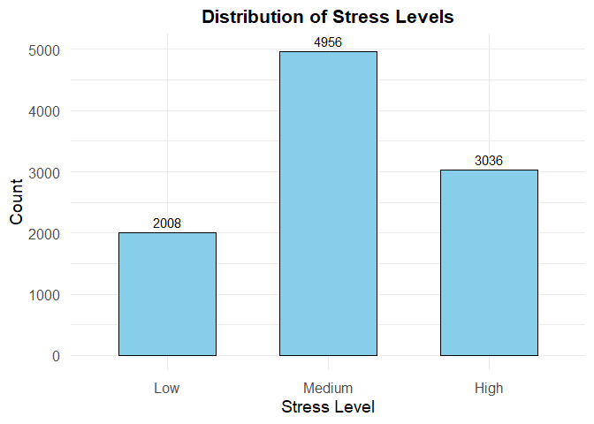

# Analysis on COVID Impact on Work

#### Bhargav Yellepeddi, Neel Rajan, Amaya Bayoumi, Ananya Ramji

## Introduction

In this analysis, we explore a dataset detailing information about how
covid had an impact on people’s work lives.

The goal of this project is to explore how Pandemics like COVID can
impact various aspects of our lives. When the COVID-19 Pandemic
occurred, society as a whole was not at all prepared on how to react,
which caused lots of famine in many counties and sent the world into
chaos. By analyzing this dataset, people can better understand what
areas of life will be impacted the most, and thus learn how to better
prepare for future events such as COVID. Ultimately, our goal is to
determine the best methods that can minimize the impacts of
Pandemic-like events.

To achieve this objective, we will explore the following questions:

1.  What cleaning methods were applied, and why?

2.  What is the distribution of the “Productivity_Change” and
    “Stress_Level” Variables?

3.  What is the impact of working from home on productivity change?

- Stress Level & Working from Home
- Sector
- Sector & Working from Home
- Childcare Responsibilities & Working from Home
- Health Issues & Working from Home

4.  Are there significant correlations between productivity_change and
    other numeric variables?

5.  Do employees who experienced salary cuts show different productivity
    trends compared to those with stable salaries?

6.  What was the impact of Childcare Responsibilities, Commuting
    Changes, and Health Issues on Technology Adaptation Levels

7.  What are the key takeaways or recommendations based on our analysis?

8.  What can we improve if this analysis were conducted again?

These are the primary questions we seek to answer in this final project.
From the information drawn from these questions, we will be able to
derive meaningful insights on the best practices to use during Pandmeics
and better understand how to prepare for them.

## Data

### Structure

    The link to the data set is the following: https://www.kaggle.com/datasets/willianoliveiragibin/covid-19-on-working-professionals/data. The Kaggle website constains a CSV file containing all the data collected to detail the impact COVID had on people's work lives. There are 15 columns for 15 variables, where each variable describes a different aspect of work and whether or not it has had any change or effect from COVID. All of the data-points are neatly organized into one CSV file, where there are exactly 10,000 rows.

    One of the most important things to note about this dataset is that fact that most of the variables report their data in a binary format. In other words, most of the data is listed in 0's and 1's, where 0 conveys that the given data-point has not been effected or changed for its given variable/column, while 1 conveys that it has. Although this may seem subtle, this has lead to a variety of issues and mis-interpretations throughout this project, which have been since fixed of course. 

    Where normally graphs depict the amount of change a variable has had, binary-based variables will depict whether or not there was any change and how much of the data has changed. When it comes to this project specifically, this is actually a valid approach as all we need to see is what variables changed in response to COVID-19. The variables that had less change indicate that they are more resilient and are of less worry, whereas the variables that have a higher proportion of change are the ones that indicate the need for more caution and preparation.

    With that said, we now move on to viewing the dataset and gaining an overall synopsis of what to expect:

``` r
# View the data 
head(data)
```

    ## # A tibble: 6 × 15
    ##   Stress_Level Sector   Increased_Work_Hours Work_From_Home Hours_Worked_Per_Day
    ##   <chr>        <chr>                   <dbl>          <dbl> <chr>               
    ## 1 Low          Retail                      1              1 6.392.393.639.805.8…
    ## 2 Low          IT                          1              1 9.171.983.537.957.5…
    ## 3 Medium       Retail                      1              0 10.612.560.951.456.…
    ## 4 Medium       Educati…                    1              1 5.546.168.647.409.5…
    ## 5 Medium       Educati…                    0              1 11.424.615.456.733.…
    ## 6 Low          IT                          1              1 7.742.897.931.229.7…
    ## # ℹ 10 more variables: Meetings_Per_Day <chr>, Productivity_Change <dbl>,
    ## #   Health_Issue <dbl>, Job_Security <dbl>, Childcare_Responsibilities <dbl>,
    ## #   Commuting_Changes <dbl>, Technology_Adaptation <dbl>, Salary_Changes <dbl>,
    ## #   Team_Collaboration_Challenges <dbl>, Affected_by_Covid <dbl>

### Cleaning

#### Overview the Data

First, we will take an overview of the Data to see what aspects needed
cleaning.

``` r
colnames(data) # View the column names to ensure proper references
```

    ##  [1] "Stress_Level"                  "Sector"                       
    ##  [3] "Increased_Work_Hours"          "Work_From_Home"               
    ##  [5] "Hours_Worked_Per_Day"          "Meetings_Per_Day"             
    ##  [7] "Productivity_Change"           "Health_Issue"                 
    ##  [9] "Job_Security"                  "Childcare_Responsibilities"   
    ## [11] "Commuting_Changes"             "Technology_Adaptation"        
    ## [13] "Salary_Changes"                "Team_Collaboration_Challenges"
    ## [15] "Affected_by_Covid"

As shown, there are 15 variables/columns.

``` r
str(data)      # Structure of the data
```

    ## spc_tbl_ [10,000 × 15] (S3: spec_tbl_df/tbl_df/tbl/data.frame)
    ##  $ Stress_Level                 : chr [1:10000] "Low" "Low" "Medium" "Medium" ...
    ##  $ Sector                       : chr [1:10000] "Retail" "IT" "Retail" "Education" ...
    ##  $ Increased_Work_Hours         : num [1:10000] 1 1 1 1 0 1 0 1 1 1 ...
    ##  $ Work_From_Home               : num [1:10000] 1 1 0 1 1 1 0 1 1 1 ...
    ##  $ Hours_Worked_Per_Day         : chr [1:10000] "6.392.393.639.805.820" "9.171.983.537.957.560" "10.612.560.951.456.400" "5.546.168.647.409.510" ...
    ##  $ Meetings_Per_Day             : chr [1:10000] "26.845.944.014.488.700" "33.392.245.834.602.800" "2.218.332.712.302.110" "5.150.566.193.312.910" ...
    ##  $ Productivity_Change          : num [1:10000] 1 1 0 0 1 1 0 0 0 0 ...
    ##  $ Health_Issue                 : num [1:10000] 0 0 0 0 0 1 0 1 1 1 ...
    ##  $ Job_Security                 : num [1:10000] 0 1 0 0 1 0 0 0 1 0 ...
    ##  $ Childcare_Responsibilities   : num [1:10000] 1 0 0 0 1 1 1 0 0 1 ...
    ##  $ Commuting_Changes            : num [1:10000] 1 1 0 1 1 1 0 1 0 1 ...
    ##  $ Technology_Adaptation        : num [1:10000] 1 1 0 0 0 1 1 1 0 1 ...
    ##  $ Salary_Changes               : num [1:10000] 0 0 0 0 1 0 0 0 0 0 ...
    ##  $ Team_Collaboration_Challenges: num [1:10000] 1 1 0 0 1 1 1 1 1 1 ...
    ##  $ Affected_by_Covid            : num [1:10000] 1 1 1 1 1 1 1 1 1 1 ...
    ##  - attr(*, "spec")=
    ##   .. cols(
    ##   ..   Stress_Level = col_character(),
    ##   ..   Sector = col_character(),
    ##   ..   Increased_Work_Hours = col_double(),
    ##   ..   Work_From_Home = col_double(),
    ##   ..   Hours_Worked_Per_Day = col_character(),
    ##   ..   Meetings_Per_Day = col_character(),
    ##   ..   Productivity_Change = col_double(),
    ##   ..   Health_Issue = col_double(),
    ##   ..   Job_Security = col_double(),
    ##   ..   Childcare_Responsibilities = col_double(),
    ##   ..   Commuting_Changes = col_double(),
    ##   ..   Technology_Adaptation = col_double(),
    ##   ..   Salary_Changes = col_double(),
    ##   ..   Team_Collaboration_Challenges = col_double(),
    ##   ..   Affected_by_Covid = col_double()
    ##   .. )
    ##  - attr(*, "problems")=<externalptr>

This code snippet reveals the structure of the Dataset. Some key things
to note are that the binary variables are all listed as numeric data
types while the rest are character data types.

``` r
summary(data)  # Summary statistics
```

    ##  Stress_Level          Sector          Increased_Work_Hours Work_From_Home  
    ##  Length:10000       Length:10000       Min.   :0.0000       Min.   :0.0000  
    ##  Class :character   Class :character   1st Qu.:0.0000       1st Qu.:1.0000  
    ##  Mode  :character   Mode  :character   Median :1.0000       Median :1.0000  
    ##                                        Mean   :0.6769       Mean   :0.8033  
    ##                                        3rd Qu.:1.0000       3rd Qu.:1.0000  
    ##                                        Max.   :1.0000       Max.   :1.0000  
    ##  Hours_Worked_Per_Day Meetings_Per_Day   Productivity_Change  Health_Issue   
    ##  Length:10000         Length:10000       Min.   :0.0000      Min.   :0.0000  
    ##  Class :character     Class :character   1st Qu.:0.0000      1st Qu.:0.0000  
    ##  Mode  :character     Mode  :character   Median :1.0000      Median :0.0000  
    ##                                          Mean   :0.5022      Mean   :0.3011  
    ##                                          3rd Qu.:1.0000      3rd Qu.:1.0000  
    ##                                          Max.   :1.0000      Max.   :1.0000  
    ##   Job_Security    Childcare_Responsibilities Commuting_Changes
    ##  Min.   :0.0000   Min.   :0.0000             Min.   :0.0000   
    ##  1st Qu.:0.0000   1st Qu.:0.0000             1st Qu.:0.0000   
    ##  Median :0.0000   Median :0.0000             Median :1.0000   
    ##  Mean   :0.4049   Mean   :0.3967             Mean   :0.5022   
    ##  3rd Qu.:1.0000   3rd Qu.:1.0000             3rd Qu.:1.0000   
    ##  Max.   :1.0000   Max.   :1.0000             Max.   :1.0000   
    ##  Technology_Adaptation Salary_Changes   Team_Collaboration_Challenges
    ##  Min.   :0.0000        Min.   :0.0000   Min.   :0.0000               
    ##  1st Qu.:0.0000        1st Qu.:0.0000   1st Qu.:0.0000               
    ##  Median :1.0000        Median :0.0000   Median :1.0000               
    ##  Mean   :0.6051        Mean   :0.1948   Mean   :0.7006               
    ##  3rd Qu.:1.0000        3rd Qu.:0.0000   3rd Qu.:1.0000               
    ##  Max.   :1.0000        Max.   :1.0000   Max.   :1.0000               
    ##  Affected_by_Covid
    ##  Min.   :1        
    ##  1st Qu.:1        
    ##  Median :1        
    ##  Mean   :1        
    ##  3rd Qu.:1        
    ##  Max.   :1

The summary statistics tells us quite a few things. One of the key
pieces of information to take away is the proportion of data-points that
were effected by their respective variables. This mainly applies to the
binary/numeric variable types as the character types simply list that
they are characters. The binary types, on the other hand, show their
mean values, which represents the proportion of data that was effected
in their column. For example, the “Job_Security” column lists a 0.4049
value for the mean, which means that around 40% of the people in the
data set experienced and impact or change to their job securities during
the impact. This indicates that job securtity was more stable than not
for the average person during the pandemic. In contrast,
“Team_Collaboration_Challenges” lists a mean value of 0.7006, meaning
that 70% of people in the dataset experinced team collaboration
challenges, indicating that this aspect is vulnerable to Pandmeic-like
events. Overall, this information alone provides valuable insights and
can allow society to better prepare for future events.

``` r
colSums(is.na(data)) # Check missing values
```

    ##                  Stress_Level                        Sector 
    ##                             0                             0 
    ##          Increased_Work_Hours                Work_From_Home 
    ##                             0                             0 
    ##          Hours_Worked_Per_Day              Meetings_Per_Day 
    ##                             0                             0 
    ##           Productivity_Change                  Health_Issue 
    ##                             0                             0 
    ##                  Job_Security    Childcare_Responsibilities 
    ##                             0                             0 
    ##             Commuting_Changes         Technology_Adaptation 
    ##                             0                             0 
    ##                Salary_Changes Team_Collaboration_Challenges 
    ##                             0                             0 
    ##             Affected_by_Covid 
    ##                             0

As shown here, all the columns have a 0 for null values, which means
that there are no empty values in any column. This means that we will
not have to worry about accounting for null values during the data
cleaning process.

``` r
unique(data)
```

    ## # A tibble: 10,000 × 15
    ##    Stress_Level Sector  Increased_Work_Hours Work_From_Home Hours_Worked_Per_Day
    ##    <chr>        <chr>                  <dbl>          <dbl> <chr>               
    ##  1 Low          Retail                     1              1 6.392.393.639.805.8…
    ##  2 Low          IT                         1              1 9.171.983.537.957.5…
    ##  3 Medium       Retail                     1              0 10.612.560.951.456.…
    ##  4 Medium       Educat…                    1              1 5.546.168.647.409.5…
    ##  5 Medium       Educat…                    0              1 11.424.615.456.733.…
    ##  6 Low          IT                         1              1 7.742.897.931.229.7…
    ##  7 Medium       IT                         0              0 6.049.957.230.122.9…
    ##  8 High         Health…                    1              1 9.515.509.560.416.3…
    ##  9 Medium       Educat…                    1              1 7.107.091.043.489.9…
    ## 10 High         Educat…                    1              1 7.836.526.647.937.0…
    ## # ℹ 9,990 more rows
    ## # ℹ 10 more variables: Meetings_Per_Day <chr>, Productivity_Change <dbl>,
    ## #   Health_Issue <dbl>, Job_Security <dbl>, Childcare_Responsibilities <dbl>,
    ## #   Commuting_Changes <dbl>, Technology_Adaptation <dbl>, Salary_Changes <dbl>,
    ## #   Team_Collaboration_Challenges <dbl>, Affected_by_Covid <dbl>

After a check for unique values, it is evident that there is an issue
with the columns “Hours_Worked_Per_Day” and “Meetings_Per_Day” as their
values do not align with typical numbers. However, the other columns
seem to have their proper data types and range of values.

#### Question 1: What cleaning methods were applied, and why

From the information listed above, we realized that not much Data
Cleaning is necessary for the dataset: the binaary values are all
already listed as numeric; the verbal columns have the proper
“character” data type; the null check shows 0 null values for all
columns, which means we do not need to perform any substitution or data
removal; and lastly, from the unique input types, except the
Hours_Worked_Per_Day and Meetings_Per_Day columns, all column indicate
that they only have the data types they should have, such as binary
variables only have binary types. That of course leaves us with the need
to fix the Hours_Worked_Per_Day and Meetings_Per_Day columns. The way
the data is inputed in these columns is very interesting; it is most
likely formatted in a different countries numeric system, especially
with the number of decimals - ex. “6.392.393.639.805.820”. At first, we
thought that maybe each input was representing multiple days of the week
per person, but the column explicitly states “Hours_Worked_Per_Day” or
“Meetings_Per_Day” implying each input describes the value per day. This
means that something like hours should range from 0-24 hours, which made
us to believe that the data was inputted without any sort of rounding,
resulting in the long floating values we see. However, after even
further analysis, we found a negative value inputted into the
“Meetings_Per_Day” column: -5.829.769.194.792.650. At this point, we
could not find any reasoning or explanattion that clarifies how this
value could exist; it is not possible to have negative meetings in a
day. With seeing the unsusally decimal input and the anomoly of negative
meetings, we finally decided that it was best to completely remove both
these columns from the dataset as it was evident that they were
corrupted.

``` r
# Remove the two problematic columns
data <- data[, !(colnames(data) %in% c("Hours_Worked_Per_Day", "Meetings_Per_Day"))]

# Confirm the columns have been removed
print(colnames(data))
```

    ##  [1] "Stress_Level"                  "Sector"                       
    ##  [3] "Increased_Work_Hours"          "Work_From_Home"               
    ##  [5] "Productivity_Change"           "Health_Issue"                 
    ##  [7] "Job_Security"                  "Childcare_Responsibilities"   
    ##  [9] "Commuting_Changes"             "Technology_Adaptation"        
    ## [11] "Salary_Changes"                "Team_Collaboration_Challenges"
    ## [13] "Affected_by_Covid"

As shown, we no longer have the problematic columns and are left with 13
variables for 13 columns.

``` r
# Re-confirm unique types
# Loop through each column and print unique values
for (col in colnames(data)) {
  cat("Unique values in", col, ":\n")
  print(unique(data[[col]]))
  cat("----------------------\n")
}
```

    ## Unique values in Stress_Level :
    ## [1] "Low"    "Medium" "High"  
    ## ----------------------
    ## Unique values in Sector :
    ## [1] "Retail"     "IT"         "Education"  "Healthcare"
    ## ----------------------
    ## Unique values in Increased_Work_Hours :
    ## [1] 1 0
    ## ----------------------
    ## Unique values in Work_From_Home :
    ## [1] 1 0
    ## ----------------------
    ## Unique values in Productivity_Change :
    ## [1] 1 0
    ## ----------------------
    ## Unique values in Health_Issue :
    ## [1] 0 1
    ## ----------------------
    ## Unique values in Job_Security :
    ## [1] 0 1
    ## ----------------------
    ## Unique values in Childcare_Responsibilities :
    ## [1] 1 0
    ## ----------------------
    ## Unique values in Commuting_Changes :
    ## [1] 1 0
    ## ----------------------
    ## Unique values in Technology_Adaptation :
    ## [1] 1 0
    ## ----------------------
    ## Unique values in Salary_Changes :
    ## [1] 0 1
    ## ----------------------
    ## Unique values in Team_Collaboration_Challenges :
    ## [1] 1 0
    ## ----------------------
    ## Unique values in Affected_by_Covid :
    ## [1] 1
    ## ----------------------

As shown above, each column lists the unique values that we expect to
see, where binary variables only have 0’s and 1’s, as they should, while
the character variables have their proper resepctive labels. At this
point, the data has been cleaned and we are ready to proceed with
further analysis.

### Variables

- Stress_Level: Indicates the employee’s stress level, categorized into
  levels such as low, moderate, or high.

- Sector: Specifies the industry or sector (e.g., Retail, IT) in which
  the employee works.

- Increased_Work_Hours: A binary variable (1/0) indicating whether the
  employee experienced an increase in work hours.

- Work_From_Home: A binary variable (1/0) showing whether the employee
  is working from home.

- Productivity_Change: A binary variable (1/0) indicating whether the
  employee experienced a change in productivity.

- Health_Issue: A binary variable (1/0) denoting whether the employee
  reported any health issues.

- Job_Security: A binary variable (1/0) indicating whether the employee
  feels secure in their job.

- Childcare_Responsibilities: A binary variable (1/0) indicating if the
  employee has childcare responsibilities.

- Commuting_Changes: A binary variable (1/0) showing whether the
  employee’s commute has changed.

- Technology_Adaptation: A binary variable (1/0) indicating if the
  employee had to adapt to new technology for work.

- Salary_Changes: A binary variable (1/0) representing whether the
  employee’s salary changed.

- Team_Collaboration_Challenges: A binary variable (1/0) indicating if
  the employee faced challenges collaborating with their team.

- Affected_by_Covid: A binary variable (1/0) specifying whether the
  employee’s work or life has been impacted by COVID-19.

Although we use most of these variables througout this analysis, our
variables of focus are going to be the “Productivity_Change” and
“Stress_Level” since these variables will tell us how society is doing
as a whole as they reflect the state of the people.

#### Question 2: What is the distribution of the “Productivity_Change” and “Stress_Level” Variables?

``` r
# Convert Productivity_Change to a factor
data$Productivity_Change <- factor(data$Productivity_Change, 
                                   levels = c(0, 1),
                                   labels = c("No Change", "Change"))

ggplot(data, aes(x = Productivity_Change)) +
  geom_bar(fill = "steelblue", color = "black", width = 0.5) +  # Narrow bars
  geom_text(stat = "count", aes(label = ..count..), 
            vjust = -0.5, size = 4) +  # Add counts on top of bars
  coord_cartesian(ylim = c(4950, 5050)) +  # Zoom in on y-axis
  labs(
    title = "Distribution of Productivity Change",
    x = "Productivity Change",
    y = "Count"
  ) +
  theme_minimal()
```

<!-- -->

Initially, we used a standard distribution graph to depict our binary
data. However, we soon realized that this was an incorrect choice, as
binary values do not follow a continuous distribution. Instead, they
require a discrete representation such as a bar chart or a specialized
binary plot which accurately captured the nature of 0s and 1s. As
illustrated in the graph, 4,978 participants reported no change in their
productivity, whereas 5,022 reported experiencing a change during the
pandemic. Although these results are quite close, they suggest a nearly
even split between individuals who felt a shift in productivity and
those who did not. We will delve deeper into these we will further see
where the changes occur. Now, let’s see the Stress_Level:

``` r
ggplot(data, aes(x = factor(Stress_Level, levels = c("Low", "Medium", "High")))) +
  geom_bar(
    fill = "skyblue", 
    color = "black", 
    width = 0.6  # Adjust bar width (spacing between bars)
  ) +
  geom_text(
    stat = 'count',
    aes(label = ..count..),  # Display counts on top of bars
    vjust = -0.5,            # Adjust position above bars
    size = 4                 # Text size
  ) +
  labs(
    title = "Distribution of Stress Levels",
    x = "Stress Level",
    y = "Count"
  ) +
  scale_y_continuous(
    breaks = seq(0, 5000, by = 1000),  # Y-axis increments by 1,000
    limits = c(0, 5000)               # Set maximum to 5,000
  ) +
  theme_minimal(base_size = 14) +
  theme(
    axis.text.x = element_text(size = 12, margin = margin(t = 5)),
    axis.text.y = element_text(size = 12, margin = margin(r = 5)),
    plot.title = element_text(hjust = 0.5, size = 16, face = "bold")
  )
```

<!-- -->

The Stress_Level variable is different from the Productivity_Change
variable in that it is not binary, but rather categorical. It made the
most sense to proceeed with a bar graph as we could depict each state of
stress and the number of people for each. The distribution indicates
that most people reported being at a medium stress level during the
Pandemic, which is what we expected. We will further analyze the dataset
to find out the effects of such stress levels, what causes them, and
what methods work in events like pandemics to minimize stress.

## Results

Question 4 explanation: From the analysis, employees experiencing medium
stress levels appear to benefit the most from remote work, as indicated
by a higher average productivity change 0.507 compared to those not
working remotely 0.484. This outcome may stem from remote work’s
flexibility and improved work life balance, which can alleviate moderate
stress. However, for high stress employees, working remotely coincides
with slightly lower productivity 0.495 versus in-person 0.525. This
suggests that highly stressed employees might need immediate, structured
support or resources not as readily available in remote settings. In
contrast, for low stress employees, productivity outcomes are nearly the
same between remote 0.501 and in person 0.51 work conditions, indicating
that their overall performance is less sensitive to work location.

## Conclusion

In conclusion, our analysis on the impact that COVID had on people’s
work lives has revealed how well prepared and un-prepared society is for
pandemic-like events. We have also confirmed what works best and what
doesn’t when attempting to adapt to such events.
