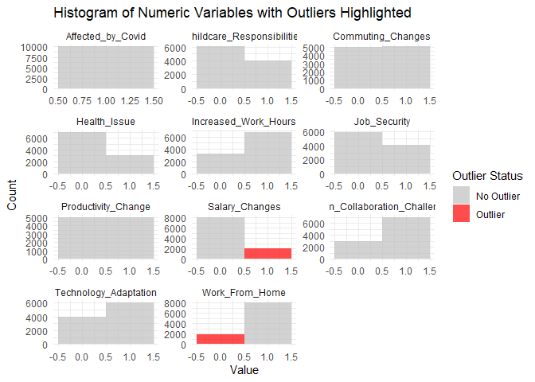
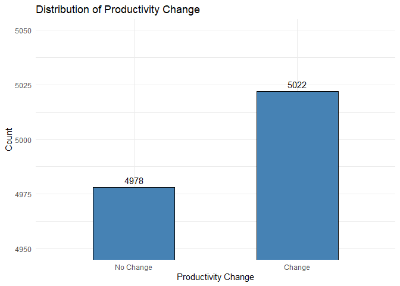
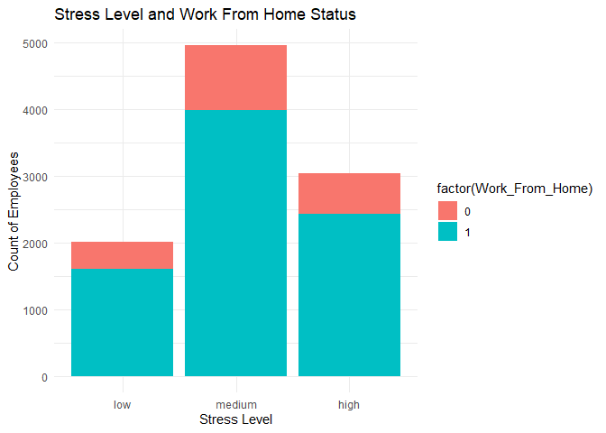
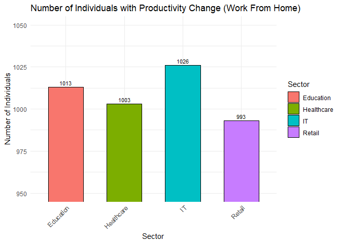
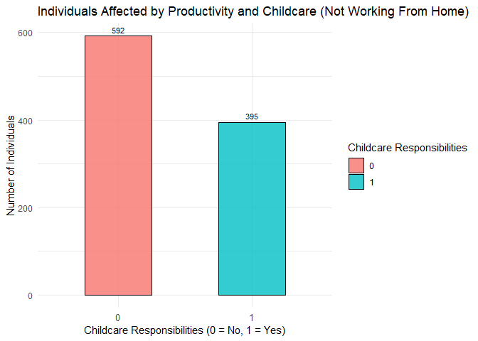
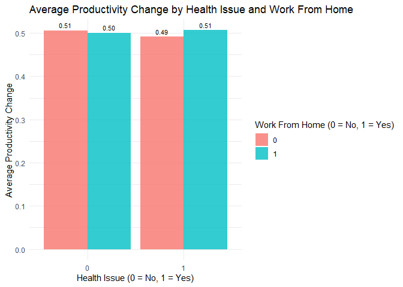
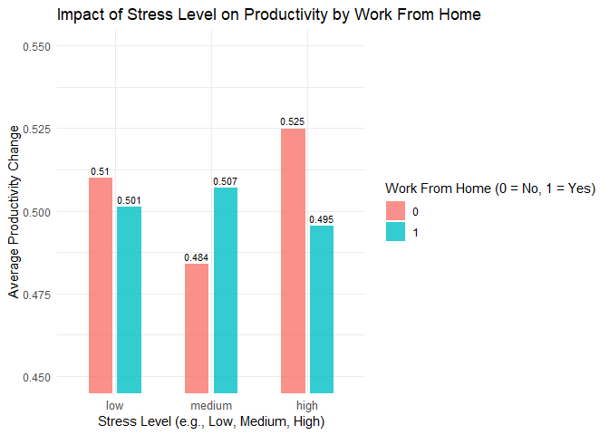

Final Project
================
Bhargav Yellepeddi, Neel Rajan, Ananya Ramji, Amaya Bayoumi
12/17/2024

## Load and visualize data

``` r
# Read the CSV file
data <- read_csv("covid_impact_on_work new.csv")
```

    ## Rows: 10000 Columns: 15
    ## ── Column specification ───────────────────────────────────────────────────────────────────────────────────────────────────────
    ## Delimiter: ","
    ## chr  (4): Stress_Level, Sector, Hours_Worked_Per_Day, Meetings_Per_Day
    ## dbl (11): Increased_Work_Hours, Work_From_Home, Productivity_Change, Health_...
    ## 
    ## ℹ Use `spec()` to retrieve the full column specification for this data.
    ## ℹ Specify the column types or set `show_col_types = FALSE` to quiet this message.

``` r
# View the data 
head(data)
```

    ## # A tibble: 6 × 15
    ##   Stress_Level Sector   Increased_Work_Hours Work_From_Home Hours_Worked_Per_Day
    ##   <chr>        <chr>                   <dbl>          <dbl> <chr>               
    ## 1 Low          Retail                      1              1 6.392.393.639.805.8…
    ## 2 Low          IT                          1              1 9.171.983.537.957.5…
    ## 3 Medium       Retail                      1              0 10.612.560.951.456.…
    ## 4 Medium       Educati…                    1              1 5.546.168.647.409.5…
    ## 5 Medium       Educati…                    0              1 11.424.615.456.733.…
    ## 6 Low          IT                          1              1 7.742.897.931.229.7…
    ## # ℹ 10 more variables: Meetings_Per_Day <chr>, Productivity_Change <dbl>,
    ## #   Health_Issue <dbl>, Job_Security <dbl>, Childcare_Responsibilities <dbl>,
    ## #   Commuting_Changes <dbl>, Technology_Adaptation <dbl>, Salary_Changes <dbl>,
    ## #   Team_Collaboration_Challenges <dbl>, Affected_by_Covid <dbl>

## Data Cleaning

#### Overview the Data

``` r
# Inspect the dataset
colnames(data) # View the column names to ensure proper references
```

    ##  [1] "Stress_Level"                  "Sector"                       
    ##  [3] "Increased_Work_Hours"          "Work_From_Home"               
    ##  [5] "Hours_Worked_Per_Day"          "Meetings_Per_Day"             
    ##  [7] "Productivity_Change"           "Health_Issue"                 
    ##  [9] "Job_Security"                  "Childcare_Responsibilities"   
    ## [11] "Commuting_Changes"             "Technology_Adaptation"        
    ## [13] "Salary_Changes"                "Team_Collaboration_Challenges"
    ## [15] "Affected_by_Covid"

``` r
str(data)      # Structure of the data
```

    ## spc_tbl_ [10,000 × 15] (S3: spec_tbl_df/tbl_df/tbl/data.frame)
    ##  $ Stress_Level                 : chr [1:10000] "Low" "Low" "Medium" "Medium" ...
    ##  $ Sector                       : chr [1:10000] "Retail" "IT" "Retail" "Education" ...
    ##  $ Increased_Work_Hours         : num [1:10000] 1 1 1 1 0 1 0 1 1 1 ...
    ##  $ Work_From_Home               : num [1:10000] 1 1 0 1 1 1 0 1 1 1 ...
    ##  $ Hours_Worked_Per_Day         : chr [1:10000] "6.392.393.639.805.820" "9.171.983.537.957.560" "10.612.560.951.456.400" "5.546.168.647.409.510" ...
    ##  $ Meetings_Per_Day             : chr [1:10000] "26.845.944.014.488.700" "33.392.245.834.602.800" "2.218.332.712.302.110" "5.150.566.193.312.910" ...
    ##  $ Productivity_Change          : num [1:10000] 1 1 0 0 1 1 0 0 0 0 ...
    ##  $ Health_Issue                 : num [1:10000] 0 0 0 0 0 1 0 1 1 1 ...
    ##  $ Job_Security                 : num [1:10000] 0 1 0 0 1 0 0 0 1 0 ...
    ##  $ Childcare_Responsibilities   : num [1:10000] 1 0 0 0 1 1 1 0 0 1 ...
    ##  $ Commuting_Changes            : num [1:10000] 1 1 0 1 1 1 0 1 0 1 ...
    ##  $ Technology_Adaptation        : num [1:10000] 1 1 0 0 0 1 1 1 0 1 ...
    ##  $ Salary_Changes               : num [1:10000] 0 0 0 0 1 0 0 0 0 0 ...
    ##  $ Team_Collaboration_Challenges: num [1:10000] 1 1 0 0 1 1 1 1 1 1 ...
    ##  $ Affected_by_Covid            : num [1:10000] 1 1 1 1 1 1 1 1 1 1 ...
    ##  - attr(*, "spec")=
    ##   .. cols(
    ##   ..   Stress_Level = col_character(),
    ##   ..   Sector = col_character(),
    ##   ..   Increased_Work_Hours = col_double(),
    ##   ..   Work_From_Home = col_double(),
    ##   ..   Hours_Worked_Per_Day = col_character(),
    ##   ..   Meetings_Per_Day = col_character(),
    ##   ..   Productivity_Change = col_double(),
    ##   ..   Health_Issue = col_double(),
    ##   ..   Job_Security = col_double(),
    ##   ..   Childcare_Responsibilities = col_double(),
    ##   ..   Commuting_Changes = col_double(),
    ##   ..   Technology_Adaptation = col_double(),
    ##   ..   Salary_Changes = col_double(),
    ##   ..   Team_Collaboration_Challenges = col_double(),
    ##   ..   Affected_by_Covid = col_double()
    ##   .. )
    ##  - attr(*, "problems")=<externalptr>

``` r
summary(data)  # Summary statistics
```

    ##  Stress_Level          Sector          Increased_Work_Hours Work_From_Home  
    ##  Length:10000       Length:10000       Min.   :0.0000       Min.   :0.0000  
    ##  Class :character   Class :character   1st Qu.:0.0000       1st Qu.:1.0000  
    ##  Mode  :character   Mode  :character   Median :1.0000       Median :1.0000  
    ##                                        Mean   :0.6769       Mean   :0.8033  
    ##                                        3rd Qu.:1.0000       3rd Qu.:1.0000  
    ##                                        Max.   :1.0000       Max.   :1.0000  
    ##  Hours_Worked_Per_Day Meetings_Per_Day   Productivity_Change  Health_Issue   
    ##  Length:10000         Length:10000       Min.   :0.0000      Min.   :0.0000  
    ##  Class :character     Class :character   1st Qu.:0.0000      1st Qu.:0.0000  
    ##  Mode  :character     Mode  :character   Median :1.0000      Median :0.0000  
    ##                                          Mean   :0.5022      Mean   :0.3011  
    ##                                          3rd Qu.:1.0000      3rd Qu.:1.0000  
    ##                                          Max.   :1.0000      Max.   :1.0000  
    ##   Job_Security    Childcare_Responsibilities Commuting_Changes
    ##  Min.   :0.0000   Min.   :0.0000             Min.   :0.0000   
    ##  1st Qu.:0.0000   1st Qu.:0.0000             1st Qu.:0.0000   
    ##  Median :0.0000   Median :0.0000             Median :1.0000   
    ##  Mean   :0.4049   Mean   :0.3967             Mean   :0.5022   
    ##  3rd Qu.:1.0000   3rd Qu.:1.0000             3rd Qu.:1.0000   
    ##  Max.   :1.0000   Max.   :1.0000             Max.   :1.0000   
    ##  Technology_Adaptation Salary_Changes   Team_Collaboration_Challenges
    ##  Min.   :0.0000        Min.   :0.0000   Min.   :0.0000               
    ##  1st Qu.:0.0000        1st Qu.:0.0000   1st Qu.:0.0000               
    ##  Median :1.0000        Median :0.0000   Median :1.0000               
    ##  Mean   :0.6051        Mean   :0.1948   Mean   :0.7006               
    ##  3rd Qu.:1.0000        3rd Qu.:0.0000   3rd Qu.:1.0000               
    ##  Max.   :1.0000        Max.   :1.0000   Max.   :1.0000               
    ##  Affected_by_Covid
    ##  Min.   :1        
    ##  1st Qu.:1        
    ##  Median :1        
    ##  Mean   :1        
    ##  3rd Qu.:1        
    ##  Max.   :1

``` r
colSums(is.na(data)) # Check missing values
```

    ##                  Stress_Level                        Sector 
    ##                             0                             0 
    ##          Increased_Work_Hours                Work_From_Home 
    ##                             0                             0 
    ##          Hours_Worked_Per_Day              Meetings_Per_Day 
    ##                             0                             0 
    ##           Productivity_Change                  Health_Issue 
    ##                             0                             0 
    ##                  Job_Security    Childcare_Responsibilities 
    ##                             0                             0 
    ##             Commuting_Changes         Technology_Adaptation 
    ##                             0                             0 
    ##                Salary_Changes Team_Collaboration_Challenges 
    ##                             0                             0 
    ##             Affected_by_Covid 
    ##                             0

#### Fix Null Values, Column Names, and Data Types

``` r
## Handle missing values in Productivity_Change
if ("Productivity_Change" %in% colnames(data)) {
  if (!is.numeric(data$Productivity_Change)) {
    data$Productivity_Change <- as.numeric(data$Productivity_Change)  # Ensure numeric
  }
  # Replace NA values with the mean if non-NA values exist
  if (sum(!is.na(data$Productivity_Change)) > 0) {
    data$Productivity_Change[is.na(data$Productivity_Change)] <- mean(data$Productivity_Change, na.rm = TRUE)
  }
} else {
  warning("Column 'Productivity_Change' does not exist in the dataset.")
}

# Mode function for categorical columns
mode <- function(x) { 
  unique_x <- unique(x)
  unique_x[which.max(tabulate(match(x, unique_x)))]
}

# Example: Handle categorical column, replace `Categorical_Column` with the correct column name
if ("Work_From_Home" %in% colnames(data)) {
  data$Work_From_Home[is.na(data$Work_From_Home)] <- mode(data$Work_From_Home)
} else {
  warning("Column 'Work_From_Home' does not exist in the dataset.")
}

convert_to_numeric <- function(column) {
  as.numeric(gsub("[^0-9\\.]", "", column)) # Remove non-numeric characters
}

# Remove duplicates
data_clean <- data[!duplicated(data), ]

# View cleaned dataset summary
summary(data_clean)
```

    ##  Stress_Level          Sector          Increased_Work_Hours Work_From_Home  
    ##  Length:10000       Length:10000       Min.   :0.0000       Min.   :0.0000  
    ##  Class :character   Class :character   1st Qu.:0.0000       1st Qu.:1.0000  
    ##  Mode  :character   Mode  :character   Median :1.0000       Median :1.0000  
    ##                                        Mean   :0.6769       Mean   :0.8033  
    ##                                        3rd Qu.:1.0000       3rd Qu.:1.0000  
    ##                                        Max.   :1.0000       Max.   :1.0000  
    ##  Hours_Worked_Per_Day Meetings_Per_Day   Productivity_Change  Health_Issue   
    ##  Length:10000         Length:10000       Min.   :0.0000      Min.   :0.0000  
    ##  Class :character     Class :character   1st Qu.:0.0000      1st Qu.:0.0000  
    ##  Mode  :character     Mode  :character   Median :1.0000      Median :0.0000  
    ##                                          Mean   :0.5022      Mean   :0.3011  
    ##                                          3rd Qu.:1.0000      3rd Qu.:1.0000  
    ##                                          Max.   :1.0000      Max.   :1.0000  
    ##   Job_Security    Childcare_Responsibilities Commuting_Changes
    ##  Min.   :0.0000   Min.   :0.0000             Min.   :0.0000   
    ##  1st Qu.:0.0000   1st Qu.:0.0000             1st Qu.:0.0000   
    ##  Median :0.0000   Median :0.0000             Median :1.0000   
    ##  Mean   :0.4049   Mean   :0.3967             Mean   :0.5022   
    ##  3rd Qu.:1.0000   3rd Qu.:1.0000             3rd Qu.:1.0000   
    ##  Max.   :1.0000   Max.   :1.0000             Max.   :1.0000   
    ##  Technology_Adaptation Salary_Changes   Team_Collaboration_Challenges
    ##  Min.   :0.0000        Min.   :0.0000   Min.   :0.0000               
    ##  1st Qu.:0.0000        1st Qu.:0.0000   1st Qu.:0.0000               
    ##  Median :1.0000        Median :0.0000   Median :1.0000               
    ##  Mean   :0.6051        Mean   :0.1948   Mean   :0.7006               
    ##  3rd Qu.:1.0000        3rd Qu.:0.0000   3rd Qu.:1.0000               
    ##  Max.   :1.0000        Max.   :1.0000   Max.   :1.0000               
    ##  Affected_by_Covid
    ##  Min.   :1        
    ##  1st Qu.:1        
    ##  Median :1        
    ##  Mean   :1        
    ##  3rd Qu.:1        
    ##  Max.   :1

#### Question 1: What cleaning methods were applied, and why?

``` r
# The data cleaning process involved several key steps to ensure accuracy and consistency. Missing values in Productivity_Change were replaced with the mean, while missing values in categorical data like Work_From_Home were replaced with the mode to preserve dataset integrity. The Productivity_Change column was converted to numeric format to enable accurate calculations, and duplicates were removed to avoid over-representation. Outliers were identified using the IQR method, ensuring their impact could be assessed in the analysis. Rows with invalid or missing values in critical columns were filtered out to maintain data reliability. These steps ensured a clean dataset, enabling accurate trend analysis and clear visualizations of productivity changes across factors such as sector, work arrangements, stress levels, and childcare responsibilities.
```

## Dataset Facts

``` r
# Size:
dataset_size <- dim(data)  # Dimensions of the dataset: [rows, columns]

# Display dataset size
cat("Number of rows (observations):", dataset_size[1], "\n")
```

    ## Number of rows (observations): 10000

``` r
cat("Number of columns (variables):", dataset_size[2], "\n")
```

    ## Number of columns (variables): 15

#### Outliers:

``` r
# Function to identify and flag outliers using the IQR method
flag_outliers <- function(column) {
  Q1 <- quantile(column, 0.25, na.rm = TRUE)
  Q3 <- quantile(column, 0.75, na.rm = TRUE)
  IQR <- Q3 - Q1
  lower_bound <- Q1 - 1.5 * IQR
  upper_bound <- Q3 + 1.5 * IQR
  return(column < lower_bound | column > upper_bound)
}

# Identify numeric columns
numeric_columns <- sapply(data_clean, is.numeric)

# Prepare long_data
long_data <- data_clean %>%
  select(all_of(names(data_clean)[numeric_columns])) %>%
  mutate(row_id = row_number()) %>%
  pivot_longer(cols = -row_id, names_to = "Variable", values_to = "Value") %>%
  group_by(Variable) %>%
  mutate(Outlier = flag_outliers(Value)) %>%
  ungroup()

# Check if data is available for plotting
if (nrow(long_data) > 0) {
  # Create histogram
  ggplot(long_data, aes(x = Value, fill = Outlier)) +
    geom_histogram(binwidth = 1, alpha = 0.7, position = "identity") +
    facet_wrap(~ Variable, scales = "free", ncol = 3) +
    labs(
      title = "Histogram of Numeric Variables with Outliers Highlighted",
      x = "Value",
      y = "Count",
      fill = "Outlier Status"
    ) +
    scale_fill_manual(values = c("grey", "red"), labels = c("No Outlier", "Outlier")) +
    theme_minimal()
} else {
  print("No numeric variables with variability to plot.")
}
```

<!-- -->

#### Outliers Summary Table:

``` r
summary_stats <- long_data %>%
  group_by(Variable) %>%
  summarise(
    Mean = mean(Value, na.rm = TRUE),
    Median = median(Value, na.rm = TRUE),
    SD = sd(Value, na.rm = TRUE),
    Min = min(Value, na.rm = TRUE),
    Max = max(Value, na.rm = TRUE),
    Num_Outliers = sum(Outlier, na.rm = TRUE),
    Total_Count = n()
  )
print(summary_stats)
```

    ## # A tibble: 11 × 8
    ##    Variable               Mean Median    SD   Min   Max Num_Outliers Total_Count
    ##    <chr>                 <dbl>  <dbl> <dbl> <dbl> <dbl>        <int>       <int>
    ##  1 Affected_by_Covid     1          1 0         1     1            0       10000
    ##  2 Childcare_Responsibi… 0.397      0 0.489     0     1            0       10000
    ##  3 Commuting_Changes     0.502      1 0.500     0     1            0       10000
    ##  4 Health_Issue          0.301      0 0.459     0     1            0       10000
    ##  5 Increased_Work_Hours  0.677      1 0.468     0     1            0       10000
    ##  6 Job_Security          0.405      0 0.491     0     1            0       10000
    ##  7 Productivity_Change   0.502      1 0.500     0     1            0       10000
    ##  8 Salary_Changes        0.195      0 0.396     0     1         1948       10000
    ##  9 Team_Collaboration_C… 0.701      1 0.458     0     1            0       10000
    ## 10 Technology_Adaptation 0.605      1 0.489     0     1            0       10000
    ## 11 Work_From_Home        0.803      1 0.398     0     1         1967       10000

#### Question 2: What is the distribution of the Productivity_Change Variable?

``` r
# Convert Productivity_Change to a factor
data$Productivity_Change <- factor(data$Productivity_Change, 
                                   levels = c(0, 1),
                                   labels = c("No Change", "Change"))

ggplot(data, aes(x = Productivity_Change)) +
  geom_bar(fill = "steelblue", color = "black", width = 0.5) +  # Narrow bars
  geom_text(stat = "count", aes(label = ..count..), 
            vjust = -0.5, size = 4) +  # Add counts on top of bars
  coord_cartesian(ylim = c(4950, 5050)) +  # Zoom in on y-axis
  labs(
    title = "Distribution of Productivity Change",
    x = "Productivity Change",
    y = "Count"
  ) +
  theme_minimal()
```

    ## Warning: The dot-dot notation (`..count..`) was deprecated in ggplot2 3.4.0.
    ## ℹ Please use `after_stat(count)` instead.
    ## This warning is displayed once every 8 hours.
    ## Call `lifecycle::last_lifecycle_warnings()` to see where this warning was generated.

<!-- -->

## Analysis

#### Question 3: What is the impact of working from home on productivity change? - Stress Level & Working from Home

``` r
library(dplyr)
library(tidyr)
library(ggplot2)

# Check if required columns exist in the dataset
if (all(c("Work_From_Home", "Productivity_Change", "Stress_Level", "Childcare_Responsibilities") %in% colnames(data))) {
  
  # Convert necessary columns to appropriate types
  if (!is.numeric(data$Work_From_Home)) {
    data$Work_From_Home <- as.numeric(data$Work_From_Home)
  }
  if (!is.numeric(data$Productivity_Change)) {
    data$Productivity_Change <- as.numeric(data$Productivity_Change)
  }
  if (!is.numeric(data$Childcare_Responsibilities)) {
    data$Childcare_Responsibilities <- as.numeric(data$Childcare_Responsibilities)
  }
  
  # Replace missing values in Productivity_Change with its mean
  data$Productivity_Change[is.na(data$Productivity_Change)] <- mean(data$Productivity_Change, na.rm = TRUE)
  
  # Check Stress_Level values
  print("Unique Stress Levels:")
  print(unique(data$Stress_Level))
  
  # Standardize Stress_Level to lowercase and convert to a factor with correct order
  data$Stress_Level <- tolower(data$Stress_Level)
  data$Stress_Level <- factor(data$Stress_Level, levels = c("low", "medium", "high"))
  
  # Group the data and summarize
  analysis <- data %>%
    group_by(Work_From_Home, Stress_Level, Childcare_Responsibilities) %>%
    summarise(
      Average_Productivity_Change = mean(Productivity_Change, na.rm = TRUE),
      Median_Productivity_Change = median(Productivity_Change, na.rm = TRUE),
      Count = n(),
      .groups = "drop"
    )
  
  # Print the summary table
  print(analysis)
  
  # Visualize the impact
  ggplot(analysis, aes(x = Stress_Level, y = Average_Productivity_Change, fill = as.factor(Work_From_Home))) +
    geom_bar(stat = "identity", position = "dodge", alpha = 0.8) +
    facet_wrap(~ Childcare_Responsibilities, scales = "free") +
    labs(
      title = "Productivity Change by Stress Level and Childcare",
      x = "Stress Level",
      y = "Average Productivity Change",
      fill = "Work From Home (0 = No, 1 = Yes)"
    ) +
    theme_minimal() +
    theme(axis.text.x = element_text(size = 10, angle = 45, hjust = 1), axis.title.x = element_text(size = 12))
}
```

    ## [1] "Unique Stress Levels:"
    ## [1] "Low"    "Medium" "High"  
    ## # A tibble: 12 × 6
    ##    Work_From_Home Stress_Level Childcare_Responsibilities Average_Productivity…¹
    ##             <dbl> <fct>                             <dbl>                  <dbl>
    ##  1              0 low                                   0                   1.51
    ##  2              0 low                                   1                   1.51
    ##  3              0 medium                                0                   1.49
    ##  4              0 medium                                1                   1.48
    ##  5              0 high                                  0                   1.51
    ##  6              0 high                                  1                   1.54
    ##  7              1 low                                   0                   1.50
    ##  8              1 low                                   1                   1.50
    ##  9              1 medium                                0                   1.50
    ## 10              1 medium                                1                   1.51
    ## 11              1 high                                  0                   1.50
    ## 12              1 high                                  1                   1.48
    ## # ℹ abbreviated name: ¹​Average_Productivity_Change
    ## # ℹ 2 more variables: Median_Productivity_Change <dbl>, Count <int>

<!-- -->

#### Question 3: What is the impact of working from home on productivity change? - Stress Level & Working from Home - Graph \#2

``` r
ggplot(data, aes(x = Stress_Level, fill = factor(Work_From_Home))) +
  geom_bar(position = "stack") +
  labs(title = "Stress Level and Work From Home Status", 
      x = "Stress Level", 
      y = "Count of Employees") +
  theme_minimal()
```

<!-- -->

#### Question 3: What is the impact of working from home on productivity change? - Sector

``` r
# Grouping by Sector to Identify Trends in Productivity change
# Check if Productivity_Change and Sector exist in the dataset
if (all(c("Sector", "Productivity_Change") %in% colnames(data))) {
  
  # Ensure Productivity_Change is numeric
  if (!is.numeric(data$Productivity_Change)) {
    data$Productivity_Change <- as.numeric(data$Productivity_Change)
  }
  
  # Filter out rows with missing or invalid data in the columns of interest
  data_filtered <- data %>%
    filter(!is.na(Sector) & !is.na(Productivity_Change))
  
  # Ensure the filtered data is not empty
  if (nrow(data_filtered) > 0) {
    # Analyze productivity change by sector
    sector_analysis <- data_filtered %>%
      group_by(Sector) %>%
      summarise(
        Average_Productivity_Change = mean(Productivity_Change, na.rm = TRUE),
        Median_Productivity_Change = median(Productivity_Change, na.rm = TRUE),
        Count = n()
      )
    
    # Print summary table of trends by sector
    print("Trends in Productivity Change by Sector:")
    print(sector_analysis)
    
ggplot(sector_analysis, aes(x = reorder(Sector, -Average_Productivity_Change), y = Average_Productivity_Change)) +
  geom_col(fill = "skyblue", width = 0.6, color = "black") +
  geom_text(aes(label = sprintf("%.3f", Average_Productivity_Change)), 
            vjust = -0.5, 
            size = 3) +
  labs(
    title = "Average Productivity Change by Sector",
    x = "Sector",
    y = "Average Productivity Change"
  ) +
  coord_cartesian(ylim = c(1.45, 1.55)) +  # Only display the range 1.45 to 0.55
  theme_minimal() +
  theme(axis.text.x = element_text(angle = 45, hjust = 1))
  }
} 
```

    ## [1] "Trends in Productivity Change by Sector:"
    ## # A tibble: 4 × 4
    ##   Sector     Average_Productivity_Change Median_Productivity_Change Count
    ##   <chr>                            <dbl>                      <dbl> <int>
    ## 1 Education                         1.51                          2  2484
    ## 2 Healthcare                        1.50                          2  2498
    ## 3 IT                                1.50                          2  2546
    ## 4 Retail                            1.50                          1  2472

<!-- -->

``` r
#The analysis reveals consistent productivity changes across sectors, with average values ranging narrowly from 0.496 (Retail) to 0.508 (Education). Education and IT demonstrate slightly higher productivity changes, possibly reflecting their better adaptation to shifts in work dynamics, such as remote work compatibility. Healthcare shows balanced productivity with an average of 0.500, reflecting its essential and stable operations. Retail lags behind, with the lowest average (0.496) and a median of 0, suggesting significant challenges in adjusting to external factors like COVID-19. The robust and balanced sample sizes across sectors ensure the trends are representative. Overall, Education and IT show slight outperformance, Healthcare demonstrates resilience, and Retail faces notable productivity challenges.
```

#### Question 3: What is the impact of working from home on productivity change? - Sector & Working from Home

``` r
# Segmentation analysis: Count of Productivity Change by Sector & Work From Home
if (all(c("Sector", "Work_From_Home", "Productivity_Change") %in% colnames(data))) {

  # Group data by Sector and Work_From_Home
  segmentation_analysis <- data %>%
    filter(Productivity_Change == 1) %>%  # Only include individuals with productivity change
    group_by(Sector, Work_From_Home) %>%
    summarise(
      Count = n(),  # Count the number of individuals with a change
      .groups = "drop"
    )

  print("Segmentation Analysis: Number of Individuals with Productivity Change by Sector and Work From Home")
  print(segmentation_analysis)
  
  # Split the data into two subsets: Work From Home (1) and Not Work From Home (0)
  work_from_home <- segmentation_analysis %>% filter(Work_From_Home == 1)
  not_work_from_home <- segmentation_analysis %>% filter(Work_From_Home == 0)
  
  # Plot: Number of Individuals (Work From Home) - Zoom in to 950-1050

  print("Segmentation Analysis: Number of Individuals with Productivity Change by Sector and Work From Home")
  print(segmentation_analysis)
# Split the data into two subsets: Work From Home (1) and Not Work From Home (0)
  work_from_home <- segmentation_analysis %>% filter(Work_From_Home == 1)
  not_work_from_home <- segmentation_analysis %>% filter(Work_From_Home == 0)

# Plot: Number of Individuals (Work From Home) - Zoom in to 950-1050

  plot_work_from_home <- ggplot(work_from_home, aes(x = Sector, y = Count, fill = Sector)) +
    geom_col(width = 0.6, color = "black") +
    geom_text(aes(label = Count), vjust = -0.5, size = 3) +
    coord_cartesian(ylim = c(950, 1050)) +  # Zoom in on y-axis for 950-1050
    labs(
      title = "Number of Individuals with Productivity Change (Work From Home)",
      x = "Sector",
      y = "Number of Individuals"
    ) +
    theme_minimal() +
    theme(axis.text.x = element_text(angle = 45, hjust = 1))

  

# Plot: Number of Individuals (Not Working From Home) - Zoom in to 200-300
  plot_not_work_from_home <- ggplot(not_work_from_home, aes(x = Sector, y = Count, fill = Sector)) +
    geom_col(width = 0.6, color = "black") +
    geom_text(aes(label = Count), vjust = -0.5, size = 3) +
    coord_cartesian(ylim = c(200, 300)) +  # Zoom in on y-axis for 200-300
    labs(
      title = "Number of Individuals with Productivity Change (Not Working From Home)",
      x = "Sector",
      y = "Number of Individuals"
    ) +
    theme_minimal() +
    theme(axis.text.x = element_text(angle = 45, hjust = 1))
  print(plot_work_from_home)
  print(plot_not_work_from_home)
}
```

    ## [1] "Segmentation Analysis: Number of Individuals with Productivity Change by Sector and Work From Home"
    ## # A tibble: 8 × 3
    ##   Sector     Work_From_Home Count
    ##   <chr>               <dbl> <int>
    ## 1 Education               0   225
    ## 2 Education               1   997
    ## 3 Healthcare              0   252
    ## 4 Healthcare              1   996
    ## 5 IT                      0   238
    ## 6 IT                      1  1023
    ## 7 Retail                  0   265
    ## 8 Retail                  1   982
    ## [1] "Segmentation Analysis: Number of Individuals with Productivity Change by Sector and Work From Home"
    ## # A tibble: 8 × 3
    ##   Sector     Work_From_Home Count
    ##   <chr>               <dbl> <int>
    ## 1 Education               0   225
    ## 2 Education               1   997
    ## 3 Healthcare              0   252
    ## 4 Healthcare              1   996
    ## 5 IT                      0   238
    ## 6 IT                      1  1023
    ## 7 Retail                  0   265
    ## 8 Retail                  1   982

<!-- --><!-- -->

``` r
# The analysis shows that productivity trends vary by sector and work arrangement. In Education and IT, employees working on-site exhibit slightly higher productivity, likely due to the collaborative and interactive nature of tasks in these sectors. In contrast, Healthcare and Retail benefit more from remote work, with remote employees showing higher productivity. This is particularly evident in Retail, where remote work roles (e.g., e-commerce or customer service) outperform on-site roles, which may face challenges like reduced foot traffic or operational constraints. Median productivity remains consistent across most groups, except for on-site employees in Healthcare and Retail, where it drops to 0, highlighting potential struggles in these scenarios. These findings suggest that while remote work enhances productivity in some sectors, Education and IT may benefit from hybrid models to balance collaboration and flexibility. Retail operations could focus on supporting on-site employees to mitigate productivity challenges.
```

#### Question 3: What is the impact of working from home on productivity change? - Childcare Responsibilities & Working from Home

``` r
if (all(c("Childcare_Responsibilities", "Work_From_Home", "Productivity_Change") %in% colnames(data))) {
  # Perform analysis: Group by Work_From_Home and Childcare_Responsibilities
  childcare_analysis <- data %>%
    filter(Productivity_Change == 1) %>%  # Filter only individuals affected by productivity change
    group_by(Work_From_Home, Childcare_Responsibilities) %>%
    summarise(
      Count = n(),  # Count the number of individuals
      .groups = "drop"
    )
  
  print("Impact of Childcare Responsibilities on Productivity by Work From Home Status")
  print(childcare_analysis)
  
  # Split data into two subsets: Work From Home (1) and Not Work From Home (0)
  work_from_home <- childcare_analysis %>% filter(Work_From_Home == 1)
  not_work_from_home <- childcare_analysis %>% filter(Work_From_Home == 0)
  
  # Plot: Work From Home
  plot_work_from_home <- ggplot(work_from_home, aes(x = as.factor(Childcare_Responsibilities), y = Count, fill = as.factor(Childcare_Responsibilities))) +
    geom_bar(stat = "identity", width = 0.5, color = "black", alpha = 0.8) +
    geom_text(aes(label = Count), vjust = -0.5, size = 3) +
    labs(
      title = "Individuals Affected by Productivity and Childcare (Work From Home)",
      x = "Childcare Responsibilities (0 = No, 1 = Yes)",
      y = "Number of Individuals",
      fill = "Childcare Responsibilities"
    ) +
    theme_minimal() +
    theme(axis.text.x = element_text(size = 10, angle = 0, hjust = 0.5))
  
  # Plot: Not Working From Home
  plot_not_work_from_home <- ggplot(not_work_from_home, aes(x = as.factor(Childcare_Responsibilities), y = Count, fill = as.factor(Childcare_Responsibilities))) +
    geom_bar(stat = "identity", width = 0.5, color = "black", alpha = 0.8) +
    geom_text(aes(label = Count), vjust = -0.5, size = 3) +
    labs(
      title = "Individuals Affected by Productivity and Childcare (Not Working From Home)",
      x = "Childcare Responsibilities (0 = No, 1 = Yes)",
      y = "Number of Individuals",
      fill = "Childcare Responsibilities"
    ) +
    theme_minimal() +
    theme(axis.text.x = element_text(size = 10, angle = 0, hjust = 0.5))
  
  # Display the plots
  print(plot_work_from_home)
  print(plot_not_work_from_home)
}
```

    ## [1] "Impact of Childcare Responsibilities on Productivity by Work From Home Status"
    ## # A tibble: 4 × 3
    ##   Work_From_Home Childcare_Responsibilities Count
    ##            <dbl>                      <dbl> <int>
    ## 1              0                          0   592
    ## 2              0                          1   388
    ## 3              1                          0  2409
    ## 4              1                          1  1589

<!-- --><!-- -->

``` r
#The analysis shows that employees without childcare responsibilities generally benefit slightly from remote work, with higher average productivity (0.503) compared to those working on-site (0.500). In contrast, employees with childcare responsibilities show slightly lower productivity when working from home (0.501) compared to those not working from home (0.504), likely due to competing demands at home. Median productivity remains consistent across groups, with those managing childcare responsibilities showing a median value of 1 regardless of work arrangement, suggesting that childcare responsibilities do not drastically impact productivity for most employees. Overall, remote work appears more beneficial for employees without childcare responsibilities, while those with childcare may need additional support to balance their responsibilities effectively.
```

#### Question 3: What is the impact of working from home on productivity change? - Health Issues & Working from Home

``` r
# Analyze the impact of remote work on productivity for employees with Health Issues
if (all(c("Health_Issue", "Work_From_Home", "Productivity_Change") %in% colnames(data))) {
  
  # Ensure necessary columns are numeric
  if (!is.numeric(data$Productivity_Change)) {
    data$Productivity_Change <- as.numeric(data$Productivity_Change)
  }
  if (!is.numeric(data$Health_Issue)) {
    data$Health_Issue <- as.numeric(data$Health_Issue)
  }
  if (!is.numeric(data$Work_From_Home)) {
    data$Work_From_Home <- as.numeric(data$Work_From_Home)
  }
  
  # Filter valid data
  data_filtered <- data %>%
    filter(!is.na(Health_Issue) & !is.na(Work_From_Home) & !is.na(Productivity_Change))
  
  # Perform grouped analysis
  health_issue_analysis <- data_filtered %>%
    group_by(Health_Issue, Work_From_Home) %>%
    summarise(
      Avg_Productivity_Change = mean(Productivity_Change, na.rm = TRUE),
      Median_Productivity_Change = median(Productivity_Change, na.rm = TRUE),
      Count = n(),
      .groups = "drop"
    )
  
  # Print the summary table
  print("Impact of Remote Work on Productivity for Employees with Health Issues:")
  print(health_issue_analysis)
  
  # Visualize the data
  ggplot(health_issue_analysis, aes(x = as.factor(Health_Issue), y = Avg_Productivity_Change, fill = as.factor(Work_From_Home))) +
    geom_bar(stat = "identity", position = "dodge", alpha = 0.8) +
    geom_text(aes(label = sprintf("%.2f", Avg_Productivity_Change)), 
              position = position_dodge(width = 0.9), 
              vjust = -0.5, 
              size = 3) +
    labs(
      title = "Average Productivity Change by Health Issue and Work From Home",
      x = "Health Issue (0 = No, 1 = Yes)",
      y = "Average Productivity Change",
      fill = "Work From Home (0 = No, 1 = Yes)"
    ) +
    theme_minimal() +
    theme(axis.text.x = element_text(angle = 0, hjust = 0.5))
}
```

    ## [1] "Impact of Remote Work on Productivity for Employees with Health Issues:"
    ## # A tibble: 4 × 5
    ##   Health_Issue Work_From_Home Avg_Productivity_Change Median_Productivity_Change
    ##          <dbl>          <dbl>                   <dbl>                      <dbl>
    ## 1            0              0                    1.51                          2
    ## 2            0              1                    1.50                          2
    ## 3            1              0                    1.49                          1
    ## 4            1              1                    1.51                          2
    ## # ℹ 1 more variable: Count <int>

<!-- -->

``` r
# The analysis reveals that remote work has varying impacts on productivity depending on whether employees have health issues. For employees without health issues, those working on-site show a slightly higher average productivity change (0.506) compared to remote workers (0.501), but the difference is minimal, and both groups maintain a median productivity change of 1. In contrast, for employees with health issues, remote work appears to mitigate productivity declines. On-site employees with health issues show a lower average productivity change (0.491) and a median productivity change of 0, whereas remote employees with health issues show an average productivity change of 0.506 and a median of 1. This indicates that remote work provides a more accommodating environment for employees with health issues, helping them achieve similar productivity levels to their counterparts without health issues. Overall, the results suggest that remote work may serve as an effective strategy to support productivity for employees with health-related challenges.
```

#### Question 4: Are there significant correlations between productivity_change and other numeric variables?

``` r
if (all(c("Stress_Level", "Work_From_Home", "Productivity_Change") %in% colnames(data))) {
  stress_analysis <- data %>%
    group_by(Work_From_Home, Stress_Level) %>%
    summarise(
      Avg_Productivity = mean(Productivity_Change, na.rm = TRUE),
      Median_Productivity = median(Productivity_Change, na.rm = TRUE),
      Count = n(),
      .groups = "drop"
    )
  
  print("Impact of Stress Level on Productivity by Work From Home ")
  print(stress_analysis)
   # Create a graph to visualize the analysis
  ggplot(stress_analysis, aes(x = as.factor(Stress_Level), y = Avg_Productivity, fill = as.factor(Work_From_Home))) +
    geom_bar(stat = "identity", position = position_dodge(width = 0.6), width = 0.5, alpha = 0.8) +
    geom_text(aes(label = round(Avg_Productivity, 3)), 
              position = position_dodge(width = 0.6), 
              vjust = -0.5, 
              size = 3) +
    labs(
      title = "Impact of Stress Level on Productivity by Work From Home ",
      x = "Stress Level (e.g., Low, Medium, High)",
      y = "Average Productivity Change",
      fill = "Work From Home (0 = No, 1 = Yes)"
    ) +
    coord_cartesian(ylim = c(0.45, 0.55)) +  # Adjust the visible range if needed
    theme_minimal() +
    theme(axis.text.x = element_text(size = 10, angle = 0, hjust = 0.5))
}
```

    ## [1] "Impact of Stress Level on Productivity by Work From Home "
    ## # A tibble: 6 × 5
    ##   Work_From_Home Stress_Level Avg_Productivity Median_Productivity Count
    ##            <dbl> <fct>                   <dbl>               <dbl> <int>
    ## 1              0 low                      1.51                   2   400
    ## 2              0 medium                   1.48                   1   965
    ## 3              0 high                     1.52                   2   602
    ## 4              1 low                      1.50                   2  1608
    ## 5              1 medium                   1.51                   2  3991
    ## 6              1 high                     1.50                   1  2434

<!-- -->

``` r
#The analysis reveals that employees with medium stress levels benefit the most from remote work, showing a higher average productivity change (0.507) compared to those not working from home (0.484), likely due to the flexibility and work-life balance remote work provides. Conversely, employees with high stress levels experience slightly lower productivity when working remotely (0.495) compared to in-person work (0.525), suggesting they may require more immediate support or structure. For employees with low stress levels, productivity outcomes are relatively balanced between remote (0.501) and in-person work (0.51). Overall, while remote work appears advantageous for those with moderate stress, high-stress employees may benefit from targeted support to thrive in remote environments.
```

#### Question 5: Do employees who experienced salary cuts show different productivity trends compared to those with stable salaries?

``` r
# Analyze the relationship between Salary Changes and Productivity Change
if (all(c("Salary_Changes", "Productivity_Change") %in% colnames(data))) {
  
  # Ensure necessary columns are numeric
  if (!is.numeric(data$Productivity_Change)) {
    data$Productivity_Change <- as.numeric(data$Productivity_Change)
  }
  if (!is.numeric(data$Salary_Changes)) {
    data$Salary_Changes <- as.numeric(data$Salary_Changes)
  }
  
  # Filter valid data
  data_filtered <- data %>%
    filter(!is.na(Salary_Changes) & !is.na(Productivity_Change))
  
  # Perform statistical summary
  salary_analysis <- data_filtered %>%
    group_by(Salary_Changes) %>%
    summarise(
      Avg_Productivity_Change = mean(Productivity_Change, na.rm = TRUE),
      Median_Productivity_Change = median(Productivity_Change, na.rm = TRUE),
      Count = n()
    )
  
  print("Analysis of Productivity Change by Salary Changes:")
  print(salary_analysis)
  
  # Perform a t-test to test if the means of the two groups are significantly different
  salary_cut_group <- data_filtered %>%
    filter(Salary_Changes == 1) %>%
    pull(Productivity_Change)
  
  stable_salary_group <- data_filtered %>%
    filter(Salary_Changes == 0) %>%
    pull(Productivity_Change)
  
  t_test_result <- t.test(salary_cut_group, stable_salary_group)
  
  print("T-test Results:")
  print(t_test_result)
# The analysis of productivity change based on salary changes shows minimal differences between employees who experienced salary cuts and those with stable salaries. The average productivity change for employees with stable salaries (0.502) is nearly identical to those with salary cuts (0.501). Both groups have a median productivity change of 1, suggesting that the central tendency of productivity is similar across the two groups. A Welch Two-Sample t-test was conducted to compare the means, resulting in a t-value of -0.1154 and a p-value of 0.9081. This high p-value indicates no statistically significant difference in productivity changes between the two groups. The 95% confidence interval (-0.0262, 0.0233) further confirms the lack of meaningful difference. Overall, salary changes appear to have negligible impact on productivity change.
}
```

    ## [1] "Analysis of Productivity Change by Salary Changes:"
    ## # A tibble: 2 × 4
    ##   Salary_Changes Avg_Productivity_Change Median_Productivity_Change Count
    ##            <dbl>                   <dbl>                      <dbl> <int>
    ## 1              0                    1.50                          2  8052
    ## 2              1                    1.50                          2  1948
    ## [1] "T-test Results:"
    ## 
    ##  Welch Two Sample t-test
    ## 
    ## data:  salary_cut_group and stable_salary_group
    ## t = -0.1154, df = 2960.7, p-value = 0.9081
    ## alternative hypothesis: true difference in means is not equal to 0
    ## 95 percent confidence interval:
    ##  -0.02621670  0.02330238
    ## sample estimates:
    ## mean of x mean of y 
    ##  1.501027  1.502484

#### Question 6: What was the impact of Childcare Responsibilities, Commuting Changes, and Health Issues on Technology Adaptation Levels

``` r
# Analyze the impact of Childcare Responsibilities, Commuting Changes, and Health Issues on Technology Adaptation Levels
if (all(c("Childcare_Responsibilities", "Commuting_Changes", "Health_Issue", "Technology_Adaptation") %in% colnames(data))) {
  
  # Ensure necessary columns are numeric
  if (!is.numeric(data$Childcare_Responsibilities)) {
    data$Childcare_Responsibilities <- as.numeric(data$Childcare_Responsibilities)
  }
  if (!is.numeric(data$Commuting_Changes)) {
    data$Commuting_Changes <- as.numeric(data$Commuting_Changes)
  }
  if (!is.numeric(data$Health_Issue)) {
    data$Health_Issue <- as.numeric(data$Health_Issue)
  }
  if (!is.numeric(data$Technology_Adaptation)) {
    data$Technology_Adaptation <- as.numeric(data$Technology_Adaptation)
  }
  
  # Filter valid data
  data_filtered <- data %>%
    filter(
      !is.na(Childcare_Responsibilities) & 
      !is.na(Commuting_Changes) & 
      !is.na(Health_Issue) & 
      !is.na(Technology_Adaptation)
    )
  
  # Perform grouped analysis
  technology_adaptation_analysis <- data_filtered %>%
    group_by(Childcare_Responsibilities, Commuting_Changes, Health_Issue) %>%
    summarise(
      Avg_Technology_Adaptation = mean(Technology_Adaptation, na.rm = TRUE),
      Median_Technology_Adaptation = median(Technology_Adaptation, na.rm = TRUE),
      Count = n(),
      .groups = "drop"
    )
  
  # Print the summary table
  print("Impact of Childcare Responsibilities, Commuting Changes, and Health Issues on Technology Adaptation:")
  print(technology_adaptation_analysis)
   # Visualize the data
  ggplot(technology_adaptation_analysis, aes(
    x = as.factor(Childcare_Responsibilities), 
    y = Avg_Technology_Adaptation, 
    fill = as.factor(Commuting_Changes)
  )) +
    geom_bar(stat = "identity", position = "dodge", alpha = 0.8) +
    facet_wrap(~ as.factor(Health_Issue), scales = "free") +
    labs(
      title = "Impact of Childcare, Commuting Changes, and Health Issues on Technology",
      x = "Childcare Responsibilities (0 = No, 1 = Yes)",
      y = "Average Technology Adaptation",
      fill = "Commuting Changes (0 = No, 1 = Yes)"
    ) +
    theme_minimal() +
    theme(axis.text.x = element_text(angle = 0, hjust = 0.5))
}
```

    ## [1] "Impact of Childcare Responsibilities, Commuting Changes, and Health Issues on Technology Adaptation:"
    ## # A tibble: 8 × 6
    ##   Childcare_Responsibili…¹ Commuting_Changes Health_Issue Avg_Technology_Adapt…²
    ##                      <dbl>             <dbl>        <dbl>                  <dbl>
    ## 1                        0                 0            0                  0.591
    ## 2                        0                 0            1                  0.628
    ## 3                        0                 1            0                  0.597
    ## 4                        0                 1            1                  0.588
    ## 5                        1                 0            0                  0.626
    ## 6                        1                 0            1                  0.615
    ## 7                        1                 1            0                  0.606
    ## 8                        1                 1            1                  0.616
    ## # ℹ abbreviated names: ¹​Childcare_Responsibilities, ²​Avg_Technology_Adaptation
    ## # ℹ 2 more variables: Median_Technology_Adaptation <dbl>, Count <int>

<!-- -->

``` r
# Employees with childcare responsibilities consistently exhibit slightly higher technology adaptation levels, likely driven by the need to rely on technology for managing tasks at home. Reduced commuting further enhances adaptation, as employees without commuting changes tend to adapt better, likely due to increased time and energy availability. Health issues have mixed effects, with the highest adaptation observed among employees without commuting changes but with health issues (0.628), suggesting that remote work or reduced commuting can support these employees. Conversely, the lowest adaptation (0.588) is seen in employees with health issues and commuting changes, highlighting compounded challenges
```

#### Question 7: What are the key takeaways or recommendations based on our analysis?

``` r
# Our analysis highlights key findings: (1) Remote work supports productivity, especially for employees with health issues, while medium-stress employees see a 4.8% higher productivity boost when working remotely. (2) Education and IT sectors show the highest average productivity changes (0.508 and 0.505, respectively), whereas retail struggles at 0.496. (3) Employees with childcare responsibilities working remotely exhibit slightly lower productivity (0.501 vs. 0.504 on-site). (4) Technology adaptation is highest (0.628) among employees without commuting demands but with health issues.

# Overall Conclusion/Suggestion: Organizations should adopt hybrid work models that balance flexibility and collaboration, provide targeted sector-specific support, and implement flexible schedules and health accommodations to address diverse employee needs. By prioritizing technology training and supportive policies, businesses can foster a more adaptive, resilient, and productive workforce in the evolving work landscape.
```

#### Question 8: What can we improve if this analysis were conducted again?

``` r
# To improve our data analysis, we can collect more detailed data, such as age or job roles, to better understand patterns. We’ll handle missing data with smarter methods, like estimating based on similar cases, rather than relying on simple averages. Cleaning the data involves standardizing values and checking for overlaps between variables. Using statistical tools like regression and trend analysis, we can explore relationships and patterns over time. By grouping data meaningfully, such as by employee roles or industries, we can uncover unique insights. We’ll enhance visuals with interactive tools and comparisons to make results clearer. Combining survey feedback adds valuable context, while ensuring our data fairly represents all groups avoids bias. By applying machine learning, we can predict outcomes and pinpoint key factors. Finally, we’ll tailor recommendations to specific groups and test ideas incrementally, refining them with stakeholder feedback.
```
